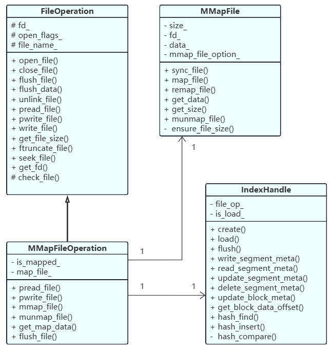
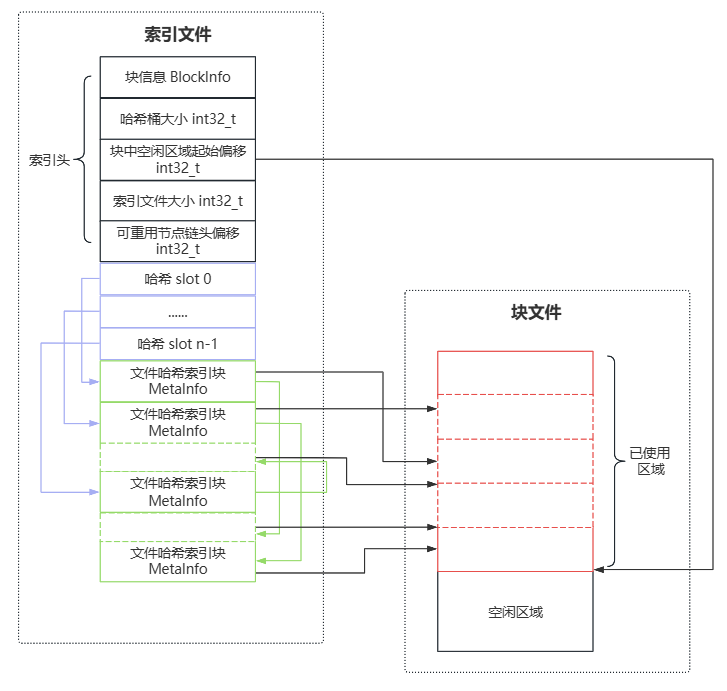

# 文件系统存储引擎

基于Linux文件系统实现的Big Block文件系统存储引擎

**文件** = **目录项** + **Inode** + **Block**  

## 设计

### 块文件

大小：64MB，块内可保存多个小文件

拥有一个唯一整数编号，该编号对应着同编号的索引文件

### 索引文件

大小：4KB左右

拥有一个唯一整数编号，该编号对应着同编号的索引文件

对于块文件内的若干小文件索引信息，由索引文件中的哈希链表实现

会在文件系统启动时**映射**到内存，提高文件检索速度

### 块内小文件

块内每个文件拥有文件编号，文件编号从1开始，依次递增

块编号与文件编号唯一标识一个文件

文件编号也是哈希查找的Key，用于定位此文件在块中的偏移

## 实现功能

具体功能实现依赖于Linux系统调用，详见代码

### 块初始化

1. 生成块文件

   - 根据指定block_id在磁盘上创建块文件

    -  为此文件分配64MB空间

2. 生成索引文件

   - 根据指定block_id，生成对应同id的索引文件
   - 索引头部初始化：块信息、索引信息初始化
   - 同步写入磁盘

### 块中写入文件

1. 加载索引文件
   - 将块对应索引文件映射至内存中
2. 文件写入至块中
   - 从上述索引文件中读取块内空闲位置偏移
   - 将文件写入块中对应偏移位置
3. 文件索引信息写入索引文件
   - 生成 MetaInfo，写入索引文件
   - 更新索引文件中的 BlockInfo
   - 索引文件同步到磁盘

### 读取块中文件

1. 加载索引文件

   - 将块对应索引文件映射至内存中

2. 获取文件 MetaInfo

   - 根据指定的文件编号，在索引文件中的哈希链表中查找此文件，

     获得其 MetaInfo

3. 根据 MetaInfo 中的信息，从块中读取该文件至内存中

### 块中删除文件

1. 加载索引文件

   - 将块对应索引文件映射至内存中

2. 获取文件 MetaInfo

   - 根据指定的文件编号，在索引文件中的哈希链表中查找此文件，

     获得其 MetaInfo

3. 索引文件中删除该 MetaInfo

   - 在索引文件的哈希链表中，删除该 MetaInfo 节点
   - 将该 MetaInfo 插入到该索引文件中的可重用空闲节点链表
   - 更新索引文件中的 BlockInfo
   - 索引文件同步到磁盘

## 类图

## 设计结构

